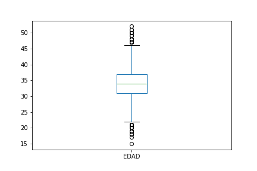

# Employability of online Bootcamps

## Objective

The aim of this project is to estimate how long it takes, after completion of online Bootcamps at Digital House, to land a job. The objective is to predict the number of days that a graduated student will take to be hired.

## About the dataset

The dataset was provided by Digital House, and Argentine coding schools with more than 99,000 graduates, in the context of the 2020 IBM Behind the Code Hackathon.

The data is a graduate-level dataset that contains personal characteristics, performance in the Digital House course and the days after completion of the course the graduate took to find a job.

## Description of the dataset

* The dataset is composed of 8,995 data points
* The variables in the dataset are: EDAD (age), GENERO (gender), RESIDENCIA (residence), NV_ESTUDIO (education level), ESTUDIO_PREV (previous area of study), TRACK_DH (name of the course), AVG_DH (final grade of the course), MINUTES_DH (number of minutes spent studying), EXPERIENCIA (previous work experience in years), DIAS_EMP (number of days to find a job).
* On average the variables have 1300 null values, except the target variable that has 0 null values as expected.

### Descriptive Statistics

#### Age:
* The average age of Digital House students is 34 years.
* 1,327 null values were found.
* There are outliers in both the upper and lower ends of the distribution (94 outliers in total). As an example, there is a 15 years old student who took 84 days finding a job, the days to find a job is not an outlier so that data points is kept.

  

