# Employability of online Bootcamps

## Objective

The objective of this project is to predict the number of days that a graduated student from online Bootcamps will take to find a job.

## About the dataset

The dataset was provided by Digital House, and Argentine coding school with more than 99,000 graduates, in the context of the 2020 IBM Behind the Code Hackathon.

The data is a graduate-level dataset that contains personal characteristics, performance in the Digital House course and the number of days that the student took to find a job after completion of the program.

## Description of the dataset

* The dataset is composed of 8,995 data points
* The variables in the dataset are: EDAD (age), GENERO (gender), RESIDENCIA (residence), NV_ESTUDIO (education level), ESTUDIO_PREV (previous area of study), TRACK_DH (name of the course), AVG_DH (final grade of the course), MINUTES_DH (number of minutes spent studying), EXPERIENCIA (previous work experience in years), DIAS_EMP (number of days to find a job).
* On average the variables have 1300 null values, except the target variable that has 0 null values as expected.

### Descriptive Statistics

#### **Days to find a job**
* The average days graduated students take to find a job is 91
* Not many outliers were found, however, all of them (4 data points) are in the upper side of the distribution. 
* The minimum amount of days that students took to find a job was 79, and the maximum 115.

  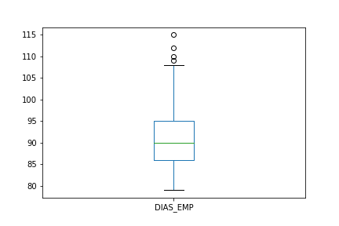

#### **Age**:
* The average age of Digital House students is 34 years.
* 1,327 null values were found.
* There are outliers in both the upper and lower ends of the distribution (94 outliers in total). As an example, there is a 15 years old student who took 84 days finding a job, the days to find a job is not an outlier so that data points is kept.

  

#### **Average performance**
* The average score in the online courses was 3.5
* 1,344 outliers were found
* There are outliers in both sides of the distribution.

  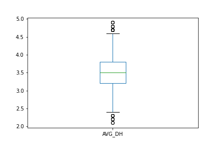

#### **Minutes dedicated to the course**
* The minutes students spent studying for the course has a lot of variability. Great concentration around the mean but high variability and outliers in both sides of the distribution.
* The average minutes dedicated to the course is 4,420.
* The max amount of minutes dedicated to the course is 7,466 and the least amount is 889

  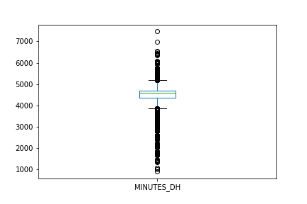
  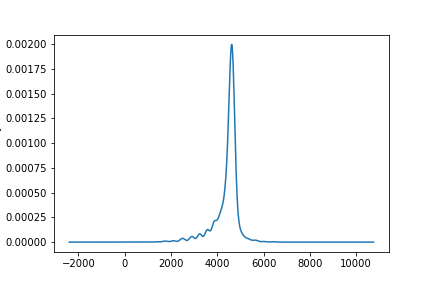

#### **Experience**
* No outliers were found in the experience variable.

  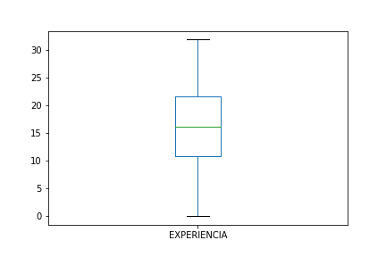

#### **Gender**
* The dataset has more men than women.
* As gender is a feature, this does not represent an imbalance problem.

  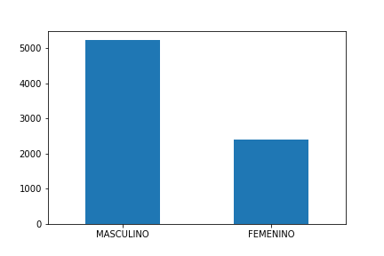

#### **Residence**
* As expected, more Argentina residents were found in the data set.

  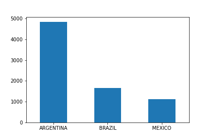

#### **Level of Studies**
* The online students are mostly concentrated in university students.

  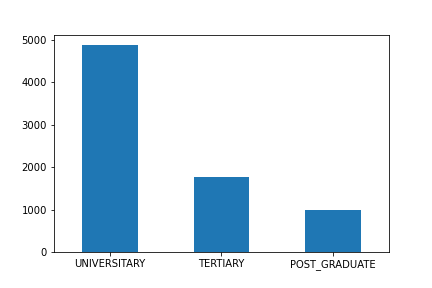

#### **Previous Studies**
* Mainly engineering students took the online classes.

  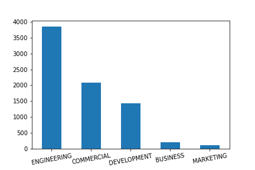

#### **Course**
* The courses offered were Data, Programming, Executive, Marketing

  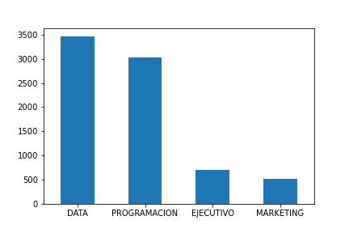

### Correlations

#### Numerical Variables
* The correlations heatmap shown below evidence a positive correlation between Age and experience and the target variable.
* We cannot conclude that AVG_DH and MINUTES_DH are not relevant covariates due to the absence of correlation with the target variable.

  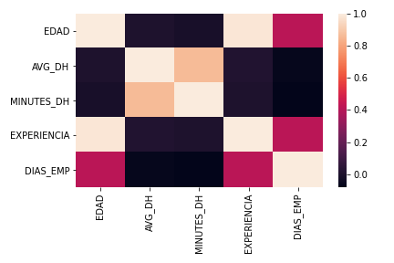

* The pairplot charts confirm the absence of correlation with the target variable, but evidences high correlation between some variables: Age and Experience, AVG_DH and MINUTES_DH.
* The high correlation could suggest colinearity bewteen covariates.

  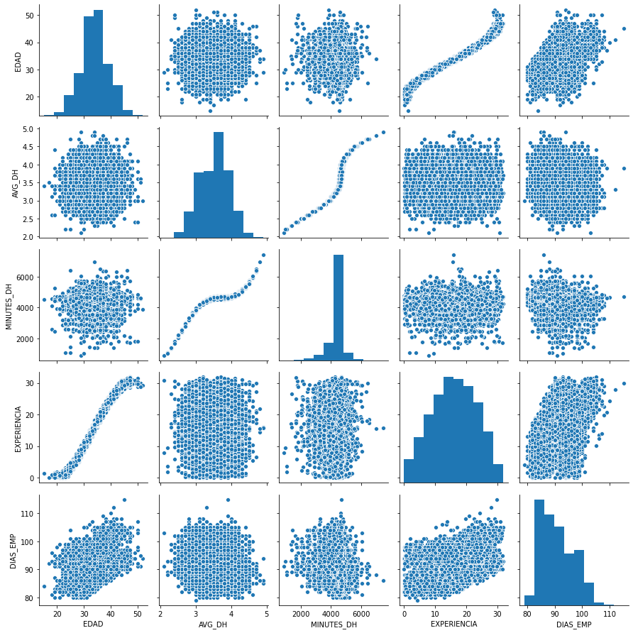

#### Categorical Variables

* There was no significant difference in mean between the groups of most categorial variables. However, the most prominent difference was found in the difference of days to find a job between men and women.

  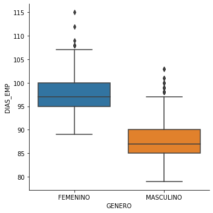

### Pipeline

For a more efficient integration with IBM Cloud, all the preprocessing steps were consolidated into a pipeline (the code can be found in transformation_pipeline.py). The setps included are:

* Column removal
* Encoding of categorical variables
* Imputation of values with iterative imputer

### Estimation

The model that best performed on the regression task of estimating the average number of days to find a job was XGBoost (R2=81%). The datails of the estimation can be found on the Jupyter Notebook.

